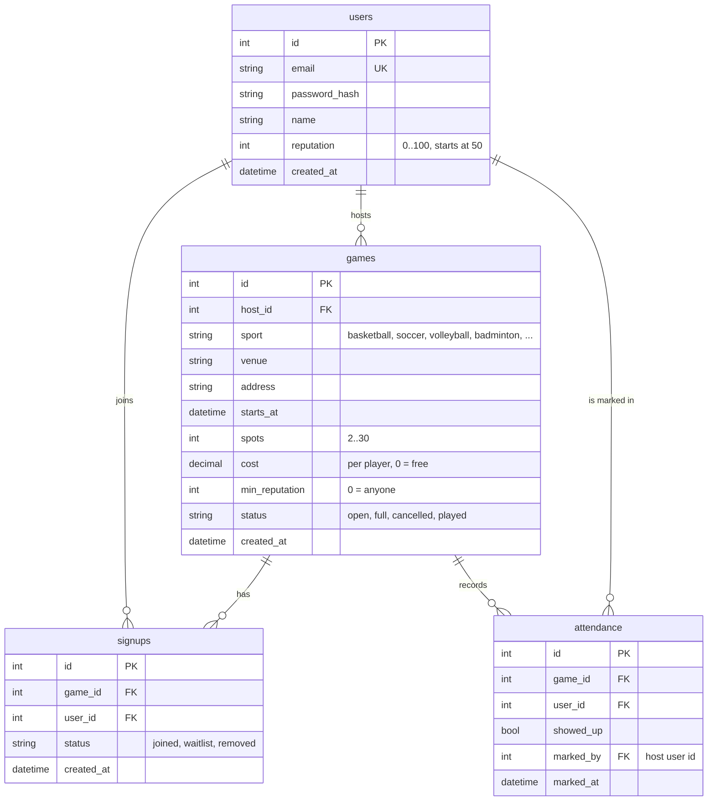

# ShowUp data model (draft for the ERD review)

Status: draft 2026-10-01, to review at the next scrum. The Figma/eraser.io ERD card produces the picture; this is the table list the migrations follow.

## Rules the tables enforce

- `signups` has a unique constraint on `(game_id, user_id)`: one row per player per game.
- `attendance` has the same unique pair. A row exists only after the host marks the game.
- `games.host_id` points at `users`. Deleting a user is out of scope for sprint 1.
- A game is **full** when the count of `signups` with status `joined` equals `spots`. The join endpoint checks this, the `status` column is a cache the host endpoints keep in sync.

## Open questions for the review

1. Is `venue` free text in sprint 1, or a `venues` table now? Free text is proposed; a table is a one-migration change later.
2. Does `reputation` live on `users` as a stored number, or get computed from `attendance` each time? Stored is proposed, recomputed when the host marks attendance.
3. Waitlist: does leaving a full game promote the first `waitlist` row automatically? Proposed yes, inside the leave endpoint.
